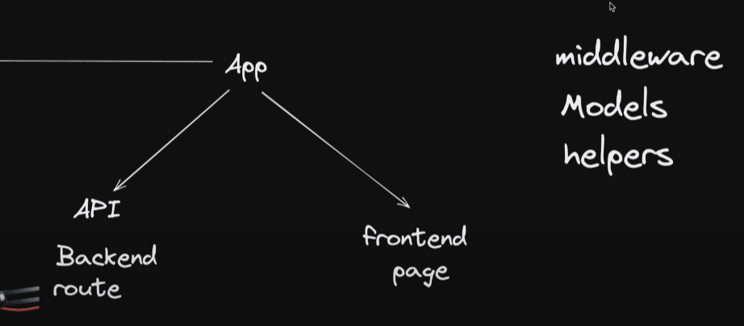

# Nextjs Full stack course

- nextjs
- mongoDB
- mongoose
- nodemail

### Convention

Use the file `middlewre.ts` (or `.js`) in the root of your project to define Middleware
For example, at the same level as `pages` or `app`, or inside `src` if applicable
